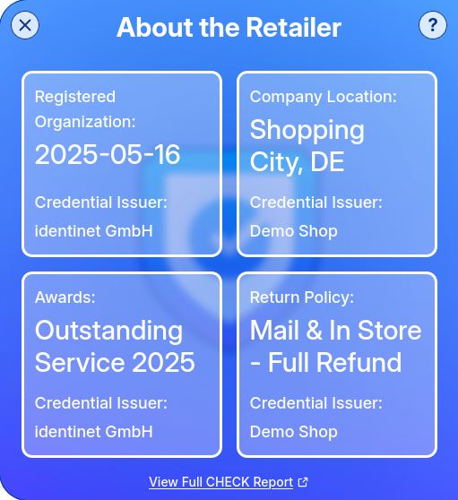

## Integrating the CHECK Trust Mark

This guide explains how to integrate the CHECK EVI (Embedded Verification
Interface) trust mark into your web shop to display verifiable organizational
data and build customer confidence.

### Motivation

New visitors to web shops are often concerned with understanding whether they
can trust the visited shop. Traditional trust indicators like SSL certificates
or generic trust badges provide limited information about the actual
organization behind the website.

Decentralized Identity and Verifiable Credentials transform the way trust can be
conveyed by:

- Linking a web shop directly to a verified organizational identity
- Sharing cryptographically verifiable claims about the organization
- Enabling customers to independently verify authenticity without relying on
  third parties

CHECK's EVI widget enables retailers to embed a dynamic trust mark in their web
shops that displays real-time verifiable data alongside the web shop's offers,
providing transparency and building customer confidence through independent
verification.

### Prerequisites

Before integrating the trust mark, ensure that you have:

1. [Obtained your organization's decentralized identifier and credentials](/guides/id)
2. [Properly shared and linked your credentials](/guides/share) to your web shop
   domain

### Steps to Integrate the Trust Mark

#### Step 1: Verify Credential Setup

Before proceeding with integration, confirm that your shared credentials are
properly linked:

1. Visit [https://check.identinet.io](https://check.identinet.io)
2. Search for your domain (e.g., `example-shop.com`)
3. Verify that your decentralized identifier is found
4. Confirm that your published credentials are displayed correctly

#### Step 2: Embed the Trust Mark

On all pages where you want to display the trust mark, embed the following code:

##### Basic Integration

```html
<html>
  ...
  <head>
    <!-- Embed this stylesheet in the header -->
    <link rel="stylesheet" href="https://evi.check.identinet.io/evi.css" />
  </head>
  <body>
    <!-- CHECK EVI Trust Mark -->
    <div id="evi-identinet"></div>
    <script src="https://evi.check.identinet.io/evi.js" type="module">
    </script>
  </body>
</html>
```

<!--
##### Advanced Configuration

For more control over the trust mark appearance and behavior:

```html
<!?-- CHECK EVI Trust Mark with Custom Configuration --?>
<div
  id="check-trust-mark"
  data-domain="example-shop.com"
  data-theme="light"
  data-position="bottom-right"
  data-size="medium"
  data-show-details="true"
>
</div>
<script
  src="https://api.check.identinet.io/widget/trust-mark.js"
  defer
></script>
```


#### Step 3: Configuration Options

Customize the trust mark behavior using data attributes:

##### Required Attributes

| Attribute     | Description                 | Example              |
| ------------- | --------------------------- | -------------------- |
| `data-domain` | Your web shop's domain name | `"example-shop.com"` |

##### Optional Attributes

| Attribute           | Description                      | Options                                                                    | Default          |
| ------------------- | -------------------------------- | -------------------------------------------------------------------------- | ---------------- |
| `data-theme`        | Visual theme                     | `"light"`, `"dark"`, `"auto"`                                              | `"auto"`         |
| `data-position`     | Trust mark position              | `"top-left"`, `"top-right"`, `"bottom-left"`, `"bottom-right"`, `"inline"` | `"bottom-right"` |
| `data-size`         | Trust mark size                  | `"small"`, `"medium"`, `"large"`                                           | `"medium"`       |
| `data-show-details` | Show credential details on hover | `"true"`, `"false"`                                                        | `"true"`         |
| `data-language`     | Display language                 | `"en"`, `"de"`, `"fr"`, `"es"`                                             | `"en"`           |

#### Step 4: Styling Integration

##### CSS Customization

The trust mark can be styled to match your web shop's design:

```css
/* Custom styling for CHECK trust mark */
##check-trust-mark {
  /* Position adjustments */
  z-index: 1000;

  /* Custom styling */
  border-radius: 8px;
  box-shadow: 0 2px 10px rgba(0, 0, 0, 0.1);
}

/* Responsive adjustments */
@media (max-width: 768px) {
  #check-trust-mark {
    transform: scale(0.8);
  }
}
```

##### Theme Integration

Integrate with your existing CSS framework:

```html
<!?-- Bootstrap Integration --?>
<div
  id="check-trust-mark"
  class="d-flex align-items-center justify-content-center"
  data-domain="example-shop.com"
  data-theme="light"
>
</div>

<!?-- Tailwind Integration --?>
<div
  id="check-trust-mark"
  class="flex items-center justify-center"
  data-domain="example-shop.com"
  data-theme="auto"
>
</div>
```

#### Step 5: Multiple Trust Marks

For complex sites with multiple pages or sections:

```html
<!?-- Product page trust mark --?>
<div
  class="check-trust-mark"
  data-domain="example-shop.com"
  data-position="inline"
  data-show-details="true"
>
</div>

<!?-- Checkout page trust mark --?>
<div?
  class="check-trust-mark"
  data-domain="example-shop.com"
  data-position="top-right"
  data-size="large"
>
</div>
```

### Implementation Examples

#### E-commerce Platform Integration

##### Shopify Integration

```liquid
<!?-- In your theme's layout/theme.liquid --?>
<div id="check-trust-mark" data-domain="{{ shop.domain }}"></div>
<script src="https://api.check.identinet.io/widget/trust-mark.js" defer></script>
```

##### WooCommerce Integration

```php
// In your theme's functions.php
function add_check_trust_mark() {
    $domain = $_SERVER['HTTP_HOST'];
    echo '<div id="check-trust-mark" data-domain="' . esc_attr($domain) . '"></div>';
    echo '<script src="https://api.check.identinet.io/widget/trust-mark.js" defer></script>';
}
add_action('wp_footer', 'add_check_trust_mark');
```

##### Custom HTML/JavaScript

```html
<!DOCTYPE html>
<html>
  <head>
    <title>Your Web Shop</title>
  </head>
  <body>
    <!?-- Your content --?>

    <!?-- CHECK Trust Mark --?>
    <div
      id="check-trust-mark"
      data-domain="example-shop.com"
      data-position="bottom-right"
      data-theme="auto"
    >
    </div>

    <script
      src="https://api.check.identinet.io/widget/trust-mark.js"
      defer
    ></script>
  </body>
</html>
```

-->

#### Step 3: Validation

Validate the integration by visiting the web shop. The CHECK EVI widget will be
loaded automatically.

##### Minimized View

<div style="width: clamp(40px, 40%, 80px); margin-right: auto; margin-left: auto;">


</div>

##### Standard View

<div style="width: clamp(200px, 60%, 300px); margin-right: auto; margin-left: auto;">


</div>

##### Detailed View

<div style="width: clamp(300px, 60%, 400px); margin-right: auto; margin-left: auto;">



</div>

### Security Considerations

- **Content Security Policy**: Add the CHECK EVI domain to your CSP if
  applicable:
  ```
  script-src 'self' https://evi.check.identinet.io;
  connect-src 'self' https://evi.check.identinet.io;
  ```
- **HTTPS Only**: Ensure your website uses HTTPS for proper widget functionality

<!--
### Troubleshooting

#### Common Issues

1. **Trust Mark Not Appearing**
   - Verify that credentials are properly shared and linked
   - Check browser console for JavaScript errors
   - Ensure the domain in `data-domain` matches your actual domain

2. **Styling Issues**
   - Check for CSS conflicts with existing styles
   - Verify z-index values for proper layering
   - Test responsive behavior on different screen sizes

3. **Verification Failures**
   - Confirm DID document accessibility
   - Verify well-known endpoints are properly configured
   - Test credential resolution using the CHECK verification interface

#### Debug Mode

Enable debug mode for troubleshooting:

```html
<div id="check-trust-mark" data-domain="example-shop.com" data-debug="true">
</div>
```

### Monitoring and Analytics

#### Verification Metrics

Monitor trust mark performance through:

- Click-through rates on trust mark interactions
- Customer engagement with verification details
- Conversion rate improvements from trust indicators

#### Error Reporting

The widget automatically reports errors to help maintain service quality:

- Failed credential retrievals
- Network connectivity issues
- Configuration problems

-->

### Next Steps

After successfully integrating the trust mark:

- [Set up customer verification](/guides/verification) using the Verifiable Data
  Service
