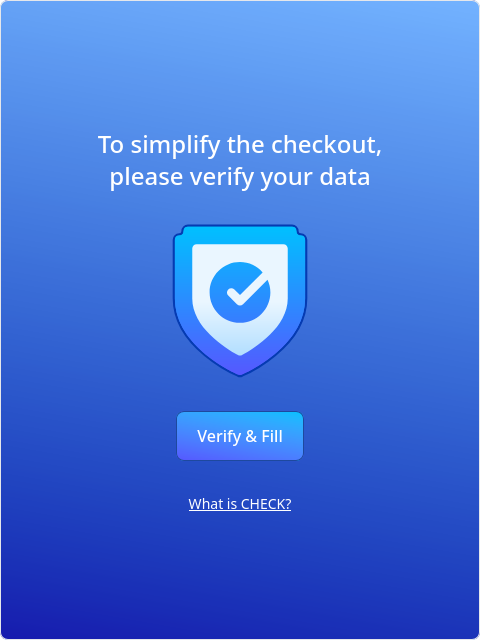
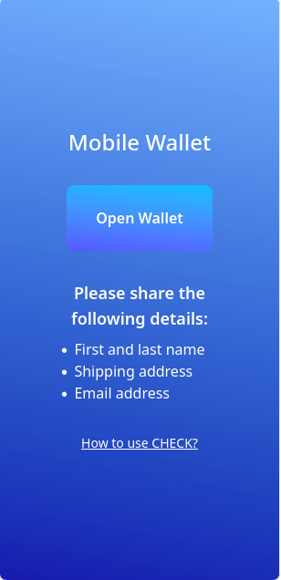
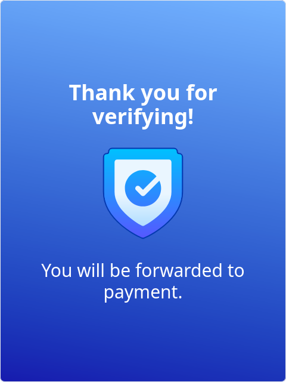

Integrating verifiable customer data into your checkout process increases trust
and enables more flexible customer interactions. For example:

- **Risk-based access**: Unlock payment options like _Pay by Invoice_ only for
  verified customers.
- **Frictionless UX**: Eliminate redundant form fields by auto-filling verified
  data (e.g., name, address, date of birth).
- **Compliance & Assurance**: Ensure that customer attributes like age or
  residency meet policy requirements—without additional validation steps.

## Step 1: Integrate the Data Request Component

The **Data Request Component** handles credential exchange with the customer in
the checkout flow. It is included in the
[demo shop service](https://github.com/identinet/check/tree/main/services/demo-shop)
and can be fully customized to fit your design and UX requirements.

Below are example views from the demo integration:

### Start View

Prompts the customer to verify their identity to continue checkout.

### Request Credentials View

Customer is asked to share verifiable credentials by scanning a QR code or using
a wallet-compatible device.

#### Desktop view

#### Mobile view

### Received Credentials View

Confirmation screen once credentials have been successfully submitted and
verified.

---

## Step 2: Integrate with the Verifiable Data Service

To enable credential exchange between your shop and the customer's wallet, your
backend and frontend must coordinate with the Verifiable Data Service.

### Backend Requirements

- **Initiate Authorization Request** The backend sends a request to the
  [Verifiable Data Service API](/api) to begin the credential exchange.

- **Receive Callback** Once the customer submits credentials, the service calls
  your backend at a pre-configured endpoint with the verified data payload.

### Frontend Requirements

- **Relay Authorization to the Customer** Display the credential request using
  one of the following methods:

  - QR code
  - [Digital Credentials API](https://w3c-fedid.github.io/digital-credentials/)
    (for browser-native credential flows - experimental)
  - Deep link into a mobile wallet

- **Handle Response Notification** The frontend must be updated once the backend
  has received credentials. Choose one of the following mechanisms:

  - **Polling**: The frontend periodically checks the backend for status
    updates.
  - **Server-Sent Events (SSE)**: The backend streams updates to the frontend.
  - **WebSockets (WS)**: Full duplex communication for more dynamic UIs.

---

### Configuration of the Verifiable Data Service

- **Credential Selection** Define which credential types should be requested
  (e.g., Government-issued ID, Proof of Age, Business Role).

- **Trusted Issuers** Specify which credential issuers are acceptable for
  verification.

## 💼 Need help?

> identinet offers [Professional Services](https://identinet.io/consulting/) to
> assist with:
>
> - Integration into existing e-commerce systems
> - Credential and issuer strategy
> - UX customization and security alignment
