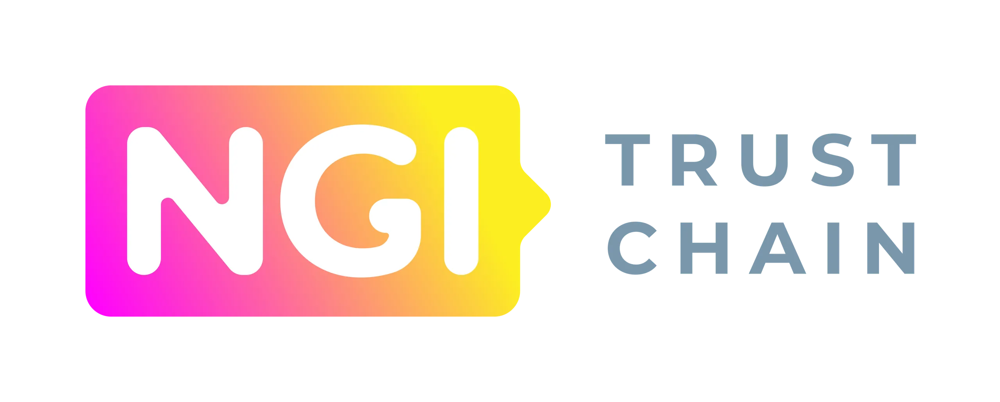

import { Card, CardGrid } from '@astrojs/starlight/components';

## Next steps

<CardGrid stagger>
  <Card title="Obtain ID" icon="star">
    Obtain your organization's W3C Decentralized Identifier (DID) from a Trust Service Provider.
  </Card>
  <Card title="Share Credentials" icon="puzzle">
    Link the ID to your `example.com` web shop and share W3C Verifiable Credentials publicly.
  </Card>
  <Card title="Integrate Trust Mark" icon="approve-check">
    Embed the CHECK EVI trust mark widget into your web shop frontend and enable customers to independently
    verify your organization's identity via the CHECK Verification Service.
  </Card>
  <Card title="Verify Customers" icon="cloud-download">
    Verify customer identities by requesting W3C Verifiable Credentials during checkout, enabling secure identity
    verification workflows.
  </Card>
</CardGrid>

## Acknowledgments

  

This project has received funding from the European Union's Horizon 2020
research and innovation program within the framework of the TRUSTCHAIN Project
funded under grant agreement 101093274.
