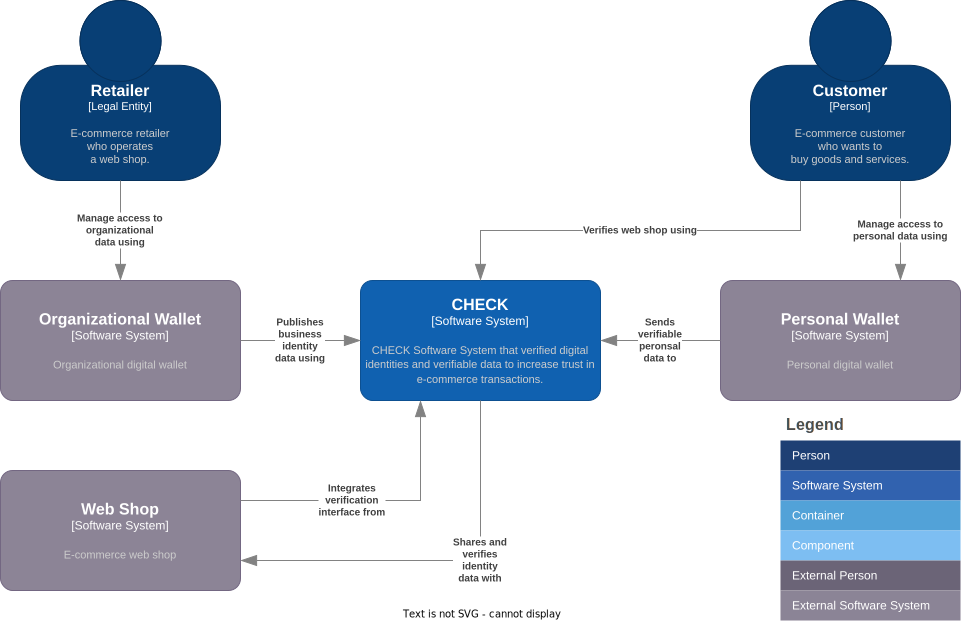
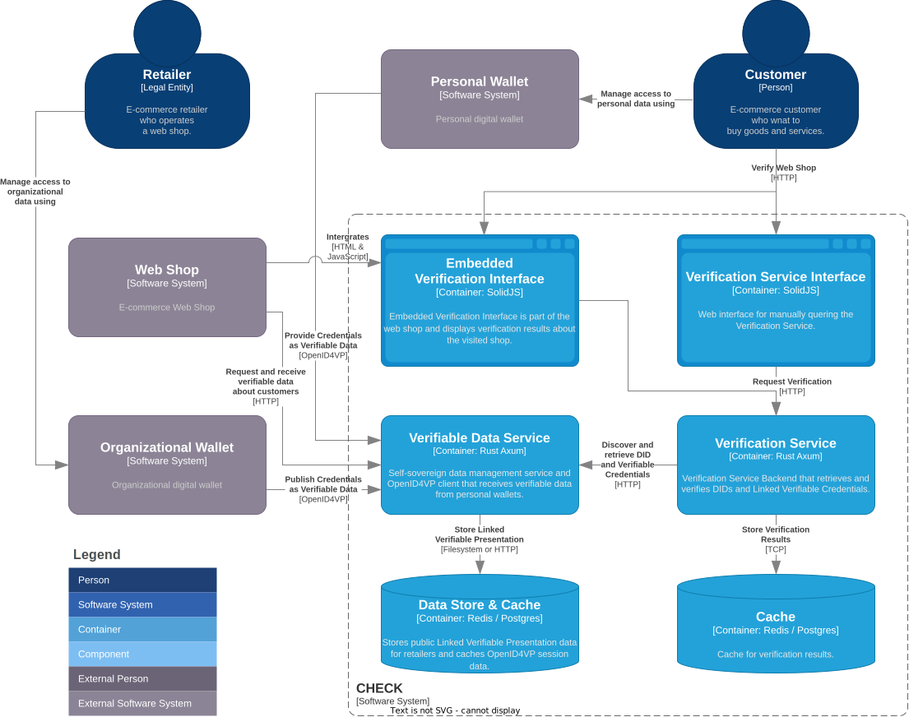

The system architecture follows the C4 model (Context, Containers, Components,
and Code) to provide a clear hierarchical view of the solution's structure. The
diagrams distinguish between existing components (color gray) and the new
components that CHECK provides (color blue).

The following C4 system and container diagrams provide a comprehensive view of
our solution's architecture, showing how the various components interact to
create a cohesive trust enhancement framework for e-commerce.

## System Context Diagram

The System Context Diagram illustrates the highest-level view of the CHECK
verification solution and its relationship with external entities. It shows how
CHECK fits into the broader e-commerce ecosystem and identifies the primary
actors and systems that interact with it.

**Customer** represents the end-users who visit web shops with the intention to
browse and purchase products or services. They seek trustworthy shopping
experiences where they can confidently engage with verified retailers without
fear of fraud or misrepresentation.

These individuals interact directly with the verification interface during their
shopping journey, making trust signals a critical factor in their purchase
decisions. While shoppers benefit from increased confidence in their online
transactions, they also play an active role in the bidirectional trust model by
providing their own credentials for verification when required, particularly for
high-value transactions or when establishing new commercial relationships.

**Retailer** encompasses web shops seeking to establish credibility with potential
customers. They integrate the CHECK verification system into their e-commerce
platform, provide business credentials for verification, and implement the
customer verification components within their transaction flow. Their active
participation in both directions of the trust verification model is essential
for the system's effectiveness and value creation.

## Container Diagram

The architecture includes four core components: Embedded Verification Interface,
Verification Service Interface, Verification Service, and Verifiable Data
Service.

> The comprehensive [demo web shop](https://demo-shop.check.identinet.io)
> demonstrates end-to-end integration of all primary components within a
> realistic e-commerce environment.

### Verification Service

**Functionality**: Serves as the core verification engine, authenticating web
shops through their Decentralized Identifiers (DIDs) via publicly accessible
Verifiable Credentials. The service discovers DID-URL connections and performs
cryptographic verification of credential authenticity according to configured
trusted issuers and schemas. The Verification Service Interface provides a
stand-alone user interface alongside the Embedded Verification Interface.

**Technologies**: Implemented in Rust programming language utilizing
[SpruceID's SSI Library](https://github.com/spruceid/ssi) for
standards-compliant credential processing, with Axum web framework providing
high-performance HTTP service capabilities. The Verification Service Interface
is using [SolidJS framework and the Solid-Start framework](https://solidjs.com)
for providing server rendering capabilities. For deployment packaging both
components utilize [NixOS](https://nixos.org) for reproducible builds with
Docker containerization.

**Status**: Complete implementation featuring comprehensive verification
functionality, including support for external DID resolvers,
[DIF Well-Known DID
Configuration specification](https://identity.foundation/.well-known/resources/did-configuration/)
compliance, and
[DIF Linked Verifiable Presentationi specification](https://identity.foundation/linked-vp/)
implementation.

### Embedded Verification Interface

**Functionality**: Provides the primary user-facing verification display,
presenting web shop verification status as integrated trust marks while enabling
visitors to inspect retailers' published Verifiable Credentials. This component
serves as the critical user touchpoint for verification results within existing
web shop interfaces. The component depends on the Verification Service and is
embedded as a JavaScript and CSS bundle within existing web shops.

**Technologies**: Built using [SolidJS framework](https://solidjs.com) packaged
through [NixOS](https://nixos.org) and Docker for consistent deployment across
diverse hosting environments.

**Status**: Complete UI implementation emphasizing accessibility and usability
principles derived from comprehensive user experience research and iterative
design refinement.

### Verifiable Data Service

**Functionality**: Operates as a secure temporary data transmission service for
customer-provided Verifiable Credentials during transaction processes.

**Technologies**: Rust implementation leveraging
[SpruceID's SSI Library](https://github.com/spruceid/ssi) for credential
processing and
[SpruceID's OpenID4VC Library](https://github.com/spruceid/openid4vp) for wallet
interoperability, with [NixOS](https://nixos.org) and Docker packaging ensuring
consistent deployment.

**Status**: Complete implementation including full
[OpenID4VP protocol](https://openid.net/specs/openid-4-verifiable-presentations-1_0-20.html)
support enabling seamless integration with EUDI-compatible wallets and other
standards-compliant credential wallets.
