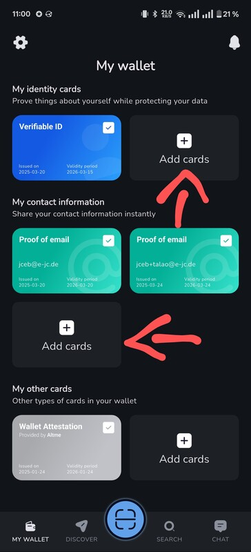
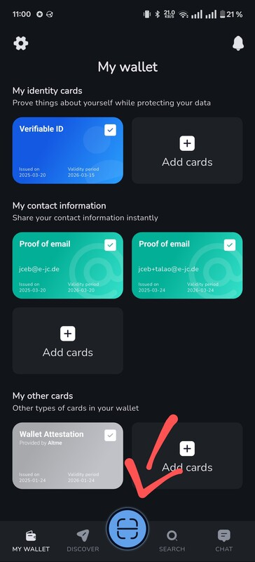

# Verifiable Data Service

Backend service that provides OpenID4VP functionality to third-party services
like web shops.

## Usage

[Full example](https://doc.wallet-provider.io/wallet/verifier-configuration#full-verifier-flow-example)

1. Install [Talao wallet](https://talao.io/talao-wallet/) or Impierce's UniMe
   wallet
   ([Android](https://play.google.com/store/apps/details?id=com.impierce.identity_wallet)
   or
   [iOS](https://apps.apple.com/us/app/unime-identity-wallet/id6451394321?l=vi))
2. Acquire credentials:



3. Start this service (`cd services/verifiable-data-service && just dev`) and
   the Demo Shop (start tunnel - `just tunnel`, caddy server `just dev` and shop
   `cd services/demo-shop && just dev`).

4. Then open the Demo Shop on the desktop or phone and go to the page that
   requests a credential: <https://TUNNEL-shop.theidentinet.com>

   Subsequently, the following steps are performed internally:

   - Initiate a session/an Authorization Request via from the Demo Shop's API
     (`POST /api/authrequests`), this calls the Verifiable Data Service
     (`POST /api/v1/authrequests`)
     - See
       [Cross-Device Flow](https://openid.net/specs/openid-4-verifiable-presentations-1_0-20.html#name-cross-device-flow)
5. Two options:
   - Same-device flow:
     - Render a button that triggers the wallet to be opened.
   - Cross-device flow:
     - Receive session URL and render it as a QR code.
     - Cross-device flow: Open a
       [Service Sent Event](https://developer.mozilla.org/en-US/docs/Web/API/Server-sent_events)
       channel (`GET /api/sse/REQUEST_ID`)from the browser that will be used as
       a notification channel from the server to the browser.
     - Scan QR code that includes the request URL with wallet.



6. Wallet retrieves Request Object.
7. Verifiable Data Service receives and verifies authenticity of data.
8. Verifiable Data Service sends redirect_uri to wallet, which triggers the
   wallet to open an endpoint at demo-shop `GET /api/sse/REQUEST_ID/NONCE`.
9. Two options:
   - Same-device flow: One the mobile device, no SSE is
   - Cross-device flow: Demo shop sends notification to browser tab to navigate
     to the next page.
10. Demo shop retrieves data from Verifiable Data Service.
    - TODO: implement functionality
    - TODO: implement basic authentication or something similar
11. Display received data in Demo shop.

### User Flow


Source:
[sequence_customer_credential_sharing.mmd](../../docs/architecture/figures/sequence_customer_credential_sharing.mmd)

### OpenAPI Endpoint Specification

[openapi.yaml](./openapi.yaml)

## Development

### Install dependencies

```shell
just install
```

### Start development server

```shell
just dev
```

## Build application

Builds the application, not the container image:

```shell
just build
```

Builds the container image. Requires Nix/NixOS!

```shell
just docker-build
just docker-load
```

## Release

- INFO: Requires Nix/NixOS
- INFO: Requires privileged access to the github repository

### Update version number

```shell
just bump
```

### Build release

```shell
just release
```

## Resoruces

### OpenID4VP

- Talao Wallet configuration for an OpenID4VP verifier:
  <https://doc.wallet-provider.io/wallet/verifier-configuration>
- OpenID4VP draft 22, implemented by the verifiable data service:
  <https://openid.net/specs/openid-4-verifiable-presentations-1_0-22.html>
  - OpenID4VC specifications and libraries:
    <https://openid.net/sg/openid4vc/specifications/>
